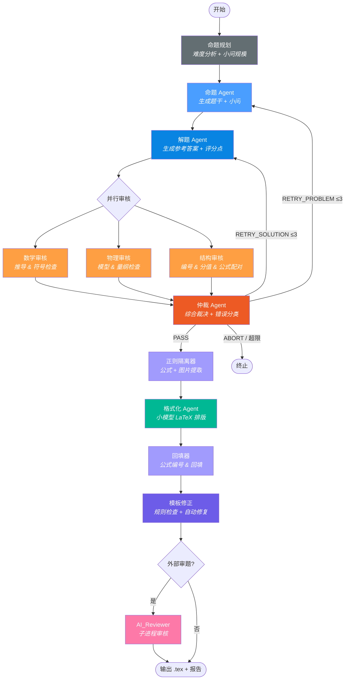
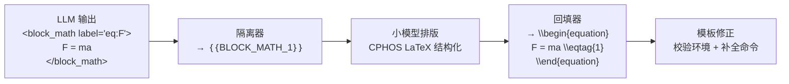

# CPhOS 物理竞赛题全自动生成系统

基于状态机编排的多 Agent AI 系统，自动生成 CPhO 决赛级物理竞赛大题。  
系统将**命题**与**解题**拆分为独立 Agent，经数学 / 物理 / 结构三重审核与仲裁闭环后，输出可编译的 CPHOS LaTeX 文档。

---

## 工作流



### 状态机阶段

系统核心是一个显式状态机 `GenerationStateMachine`，阶段定义如下：

```
INIT → PLANNING → PROBLEM_GENERATING → SOLUTION_GENERATING
     → REVIEWING → ARBITRATING
     → FORMATTING → TEMPLATE_FIXING → [EXTERNAL_REVIEWING] → DONE
     任意阶段异常 → ERROR
```

### 节点说明

| 节点 | 模型 | 职责 |
|------|------|------|
| 命题规划 | 大模型 | 分析主题与难度，输出规划笔记（小问数量、分值分配、物理情境建议） |
| 命题 Agent | 大模型 | 根据规划生成题干与小问，支持重试时接收仲裁反馈 |
| 解题 Agent | 大模型 | 根据题干生成参考答案与评分点，解题与命题独立迭代 |
| 数学审核 | 大模型 | 验证代数 / 微积分推导、符号一致性 |
| 物理审核 | 大模型 | 验证物理模型、量纲、边界条件 |
| 结构审核 | **纯规则** | 小问编号连续性、分值合计、block_math 配对、label 唯一性 |
| 仲裁 Agent | 大模型 | 综合三份审核报告，通过 Function Calling 输出结构化裁决 |
| 正则隔离器 | — | 提取标题、Block / Inline 公式、Figure 占位符 |
| 格式化 Agent | 小模型 | 对占位符文本做 CPHOS LaTeX 排版（不接触数学公式） |
| 回填器 | — | 公式回填、CPHOS 命令生成、交叉引用、插图占位 |
| 模板修正 | **纯规则** | 校验 LaTeX 环境匹配、占位符残留、自动补 `\scoring` 和 `\documentclass` |
| AI_Reviewer | 子进程 | 可选：调用 AI_Reviewer 外部审题工具，输出结构化反馈 |

### 仲裁路由

| 裁决 | 含义 | 路由 |
|------|------|------|
| `PASS` | 题目合格 | → 后处理流水线 |
| `RETRY_PROBLEM` | 题干有误 | → 回到命题 Agent（重新出题），`problem_retry_count += 1` |
| `RETRY_SOLUTION` | 解答有误 | → 回到解题 Agent（保留题干，重新解题），`solution_retry_count += 1` |
| `ABORT` | 不可修复错误 | → 流程终止 |
| *阶段重试超限 + `style`* | 仅有用语问题 | → 自动切为 `PASS_WITH_EDITS` |

**重试计数语义**（分阶段计数）：

- `problem_retry_count` 仅记录 `RETRY_PROBLEM` 的触发次数；`solution_retry_count` 仅记录 `RETRY_SOLUTION` 的触发次数；`retry_count` = 两者之和。
- 首轮生成不计 retry：仅当仲裁返回 `RETRY_PROBLEM` / `RETRY_SOLUTION` 时对应阶段 +1，PASS / ABORT 不递增。
- 熔断条件：任一阶段达到 `MAX_RETRY_COUNT`（默认 3）即终止当前阶段；总次数达 `2 × MAX_RETRY_COUNT` 硬兜底，避免两阶段交替震荡。

### LLM 调用预算

一次成功（首轮 PASS）的 LLM 调用数：

| 阶段 | 次数 | 使用模型 |
|------|------|----------|
| 命题规划（planner） | 1 | `BIG_MODEL_NAME` |
| 命题生成 | 1 | `BIG_MODEL_NAME` |
| 解题生成 | 1 | `BIG_MODEL_NAME` |
| 数学审核 + 物理审核（并行） | 2 | `BIG_MODEL_NAME` |
| 结构审核 | **0（纯规则，无 LLM 调用）** | — |
| 仲裁 | 1 | `BIG_MODEL_NAME` |
| 格式化 | 1 | `SMALL_MODEL_NAME` |
| 模板修正 | **0（纯规则，无 LLM 调用）** | — |
| AI_Reviewer 外部审题（`--review` 启用时） | 由子进程自行调用 | — |

合计：**首轮 PASS 的基准调用 = 6 次 BIG + 1 次 SMALL**。每次 `RETRY_PROBLEM` / `RETRY_SOLUTION` 追加 4 次 BIG（重跑该阶段生成 + 两份审核 + 一次仲裁）。

> **为什么 planner 使用 BIG_MODEL？** 命题规划需要综合难度目标、分值分配与物理模型选型，是后续所有生成的上下文锚点，使用强模型可显著降低下游重试率；相对 6 次 BIG 的基础开销，再加 1 次是边际可忽略的成本。

---

## 命题模式

系统支持 4 种命题模式，所有模式共用同一条状态机工作流，差异仅在输入规格与规划提示词：

| 模式 | CLI 用法 | 说明 |
|------|---------|------|
| `topic_generation` | `--topic "刚体力学"` | 自由命题：从主题出发创作全新竞赛题 |
| `literature_adaptation` | `--adapt paper.pdf --mode literature_adaptation` | 文献改编：基于学术文献改编为竞赛题 |
| `idea_expansion` | `--adapt sketch.txt --mode idea_expansion` | 思路拓展：从简要构想扩展为完整试题 |
| `problem_enrichment` | `--adapt simple.tex --mode problem_enrichment` | 题目丰富：在简单题基础上增加考察深度 |

不指定 `--mode` 时，系统根据是否提供 `--adapt` 自动推断。

---

## 快速开始

> 需要 Python ≥ 3.11 和 [uv](https://docs.astral.sh/uv/)。

```bash
# 1. 安装依赖
uv sync

# 2. 配置环境变量
copy .env.example .env          # Windows
# cp .env.example .env          # macOS / Linux
# 编辑 .env，填入 LLM 服务商密钥和模型名称

# 3. 运行
uv run physics-generator --topic "刚体力学与角动量守恒"
uv run physics-generator --topic "电磁感应" --difficulty "省级竞赛"
uv run physics-generator --topic "电磁感应" --score 60
uv run physics-generator --input task.json
uv run physics-generator --adapt existing_problem.tex --mode problem_enrichment
uv run physics-generator --topic "相对论力学" --review   # 启用外部审题

# 4. 测试
uv run pytest -v
```

### CLI 参数

```
physics-generator --topic TEXT           # 物理主题（与 --input/--adapt 互斥）
                  --input FILE           # 从 JSON 文件加载（与 --topic/--adapt 互斥）
                  --adapt FILE           # 基于已有材料改编（与 --topic/--input 互斥）
                  --difficulty TEXT       # 难度等级（默认: 国家集训队）
                  --score INT            # 题目总分（20-80，默认: 50）
                  --mode MODE            # 命题模式（topic_generation / literature_adaptation
                                         #           / idea_expansion / problem_enrichment）
                  --review               # 启用 AI_Reviewer 外部审题
                  --log                  # 追加运行记录到 TEST_LOG.md
```

### 环境变量

复制 `.env.example` 为 `.env` 并填入配置：

| 变量 | 说明 | 默认值 |
|------|------|--------|
| `LLM_PROVIDER` | LLM 服务商 | `openrouter` |
| `OPENROUTER_API_KEY` | OpenRouter API 密钥 | — |
| `LLM_API_KEY` | OpenAI 兼容 API 密钥（仅 `openai_compatible`） | — |
| `LLM_BASE_URL` | OpenAI 兼容 API 地址（仅 `openai_compatible`） | — |
| `BIG_MODEL_NAME` | 大模型（命题 / 审核 / 仲裁） | — |
| `SMALL_MODEL_NAME` | 小模型（格式化排版） | — |
| `BIG_MODEL_TEMPERATURE` | 大模型温度 | `0.7` |
| `BIG_MODEL_MAX_TOKENS` | 大模型最大 token 数 | `32768` |
| `ARBITER_MAX_TOKENS` | 仲裁最大 token 数 | `4096` |
| `SMALL_MODEL_TEMPERATURE` | 小模型温度 | `0.0` |
| `SMALL_MODEL_MAX_TOKENS` | 小模型最大 token 数 | `8192` |
| `MODEL_TIMEOUT` | HTTP 超时（秒） | `600` |
| `MAX_RETRY_COUNT` | 仲裁最大重试轮数 | `3` |
| `ENABLE_EXTERNAL_REVIEW` | 默认是否启用外部审题 | `false` |
| `OUTPUT_DIR` | 输出目录 | `output` |

### 从旧版本升级

本次重构改动了包结构与部分模块路径，既有 `.env` 通常**无需改动即可继续运行**。如果你是从 `feat/architecture-restructure` 之前的版本（或 `main` 上的 `d355fe7` 及更早）升级，参考下表：

| 类别 | 旧 | 新 | 迁移动作 |
|------|-----|----|---------|
| 配置模块 | `src/config/settings.py` | `src/config/config.py` | 仅在你直接 `import` 过该模块时需改：`from config.settings import X` → `from config.config import X` |
| 包布局 | `src/generator/`、`src/graph/`、`src/formatter/` | `src/agents/`、`src/engine/`、`src/latex/` | 老包已删除；如有自定义脚本 `import` 了它们，改为对应新位置 |
| 环境变量 | `BIG_MODEL_TEMPERATURE` 等为代码内常量 | 全部改为 `.env` 可配置，默认值不变 | 不需要动；如想调整，参照 [`.env.example`](.env.example) 往自己的 `.env` 里补 |
| 新增环境变量 | — | `ENABLE_EXTERNAL_REVIEW`、`OUTPUT_DIR`（均可选，均有默认值） | 不需要动；按需追加 |
| 必填环境变量 | `BIG_MODEL_NAME`、`SMALL_MODEL_NAME` + 一个服务商密钥 | 同左 | 无变化 |

**推荐操作**：`diff` 一下自己的 `.env` 与仓库里的 `.env.example`，把新增项按需补齐；其它的什么都不用改。拉完代码直接 `uv sync && uv run physics-generator --topic ...` 即可。

### 可选外部工具：AI_Reviewer

启用 `--review` 或 `ENABLE_EXTERNAL_REVIEW=true` 时，系统会通过 `subprocess` 调用外部 CLI `ai-reviewer`（项目 [CPHOS/AI_Reviewer](https://github.com/CPHOS/AI_Reviewer)）对最终 LaTeX 做二次审题。

- `ai-reviewer` **不是** PyPI 包，也未在 `pyproject.toml` 核心依赖中声明；需按其项目 README 单独安装，使 `ai-reviewer --help` 可在 PATH 中执行即可。
- 未安装时 `src/integration/ai_reviewer.py` 会打印安装指引并直接跳过外部审题，**主流程不受影响**。
- 如果未来 `ai-reviewer` 发布到 PyPI，可通过 `uv pip install .[review]`（见 `pyproject.toml` 的 `[project.optional-dependencies]`）补齐。

---

## 项目结构

```
AI_Question/
├── pyproject.toml                  # 项目元数据 & 依赖
├── .env.example                    # 环境变量模板
├── src/
│   ├── app/                        # CLI 入口与输出写入
│   │   ├── __init__.py             #   main(), _cli(), _write_outputs()
│   │   └── __main__.py             #   python -m app 入口
│   │
│   ├── engine/                     # 核心状态机
│   │   └── state_machine.py        #   Phase(Enum) + GenerationStateMachine
│   │
│   ├── spec/                       # 输入规格 & 命题规划
│   │   ├── task.py                 #   QuestionMode, DifficultyProfile, TaskSpec
│   │   ├── normalizer.py           #   from_cli() / from_json() → WorkflowData
│   │   └── planner.py              #   run_planning() — LLM 命题规划
│   │
│   ├── agents/                     # 各 Agent 实现（每个文件一个 Agent）
│   │   ├── problem_generator.py    #   命题 Agent（生成题干 + 小问）
│   │   ├── solution_generator.py   #   解题 Agent（生成答案 + 评分点）
│   │   ├── reviewers.py            #   数学 / 物理 / 结构审核（并行执行）
│   │   └── arbiter.py              #   仲裁 Agent（Function Calling 结构化裁决）
│   │
│   ├── latex/                      # LaTeX 后处理流水线
│   │   ├── isolate.py              #   正则隔离器（Block + Inline + Figure 提取）
│   │   ├── format.py               #   格式化 Agent（小模型 CPHOS 排版）
│   │   ├── merge.py                #   回填器（公式编号 + CPHOS 命令 + 插图）
│   │   └── template_agent.py       #   模板修正（规则检查 + 自动修复）
│   │
│   ├── integration/                # 外部系统集成
│   │   ├── ai_reviewer.py          #   AI_Reviewer 子进程调用
│   │   └── feedback.py             #   外部审核报告 → 反馈适配
│   │
│   ├── client/                     # LLM 客户端（多服务商抽象）
│   │   ├── __init__.py             #   get_client() 工厂 + stream_chat() 包装
│   │   ├── base.py                 #   BaseLLMClient 抽象基类 + UsageInfo
│   │   ├── openrouter.py           #   OpenRouter 实现
│   │   └── openai_compat.py        #   通用 OpenAI 兼容实现（DeepSeek 等）
│   │
│   ├── config/                     # 全局配置
│   │   └── config.py               #   基于 .env 的配置管理
│   │
│   ├── model/                      # 数据模型
│   │   ├── state.py                #   WorkflowData (TypedDict) — 全局流转数据
│   │   ├── schema.py               #   ArbiterDecision, TemplateFixReport (Pydantic)
│   │   └── stats.py                #   运行时 Token 统计
│   │
│   ├── prompts/                    # YAML 提示词
│   │   ├── __init__.py             #   load(agent, key, **kwargs) 加载器
│   │   ├── planning.yaml           #   命题规划提示词（4 种模式）
│   │   ├── problem_generator.yaml  #   命题 Agent 提示词
│   │   ├── solution_generator.yaml #   解题 Agent 提示词
│   │   ├── reviewers.yaml          #   数学 / 物理审核提示词
│   │   ├── arbiter.yaml            #   仲裁 Agent 提示词
│   │   └── formatter.yaml          #   格式化 Agent 提示词
│   │
│   └── utils/                      # 工具函数
│       └── files.py                #   write_text(), write_json()
│
└── tests/
    ├── test_state_machine.py       # 状态机集成测试（Mock LLM）
    ├── test_parser.py              # 正则隔离器单元测试
    ├── test_merger.py              # 回填器单元测试
    ├── topics.py                   # 测试用主题池加载器
    └── fixtures/
        └── topics.js               # 物理命题主题数据
```

---

## 输出文件

每次运行在 `output/` 下生成：

| 文件 | 内容 |
|------|------|
| `{task_id}_final.tex` | 可直接编译的 CPHOS LaTeX 成品 |
| `{task_id}_draft.md` | 大模型原始草稿（题干 + 解答） |
| `{task_id}_tagged.md` | 占位符文本（调试用） |
| `{task_id}_log.json` | 完整运行日志（裁决、理由、审核意见、模板报告等） |
| `{task_id}_report.md` | 仲裁报告 |
| `{task_id}_assets/README.md` | 插图绘制需求（仅题目含图时生成） |

---

## 提示词管理

所有 Agent 的提示词存放在 `src/prompts/*.yaml`，使用 YAML 多行文本块（`|`）书写，避免 Python 字符串的转义问题。

```python
from prompts import load

# 加载系统提示词
system = load("problem_generator", "system_prompt")

# 加载用户提示词（带变量替换）
user = load("problem_generator", "user_prompt_topic", topic="电磁感应", difficulty="国家集训队")
```

变量替换使用 `str.replace("{key}", value)`，仅替换显式传入的 key，LaTeX 花括号和占位符不受影响。

---

## 占位符处理流程



---

## CPHOS 模板对齐

输出的 LaTeX 文档严格对齐 CPHOS 竞赛模板：

- 文档类：`\documentclass[answer]{cphos}`
- 题目环境：`\begin{problem}[总分]{标题}` — 标题由命题模型自动拟定
- 公式编号：`\eqtag{N}` / `\eqtagscore{N}{分值}` + `\label{eq:N}`
- Part 标记：`\pmark{A}\label{part:A}` / `\solPart{A}{分值}`
- 一级小问：`\subq{1}\label{q:1}` / `\solsubq{1}{分值}`
- 二级小问：`\subsubq{1.1}\label{q:1.1}` / `\solsubsubq{1.1}{分值}`
- 三级小问：`\subsubsubq{1.1.1}\label{q:1.1.1}` / `\solsubsubsubq{1.1.1}{分值}`
- 评分标准：`\scoring`（自动插入）
- 插图占位：输出时默认注释，完成人工绘图后取消注释即可显示

### 分数段命题规模引导

系统根据 `--score` 自动选择对应分段的命题规模引导：

| 分数段 | 小问数 | 复杂度 | 典型场景 |
|--------|--------|--------|----------|
| 20–39 分 | 2–3 | 物理图像 + 基本方程 | 复赛小题、模拟题 |
| 40–60 分 | 3–4 | 完整建模 + 中等推导 | 复赛大题、决赛标准题 |
| 61–80 分 | 4–5 | 深度推导 + 多级微扰 | 决赛压轴题 |

### 小问编号规范

| 层级 | 题干格式 | 解答格式 | LaTeX 命令 |
|------|---------|---------|------------|
| Part | `A. 描述文本` | `A.[X分]` | `\pmark{A}` / `\solPart{A}{X}` |
| 一级 | `(1) 描述文本` | `(1)[X分]` | `\subq{1}` / `\solsubq{1}{X}` |
| 二级 | `(1.1) 描述文本` | `(1.1)[X分]` | `\subsubq{1.1}` / `\solsubsubq{1.1}{X}` |
| 三级 | `(1.1.1) 描述文本` | `(1.1.1)[X分]` | `\subsubsubq{1.1.1}` / `\solsubsubsubq{1.1.1}{X}` |

### 仲裁错误分类

仲裁 Agent 对每次审核输出错误分类：

| 分类 | 含义 | 仲裁行为 |
|------|------|----------|
| `none` | 无错误 | 直接 PASS |
| `style` | 仅用语规范问题 | RETRY；若达到重试上限则自动切换为 PASS_WITH_EDITS 通过 |
| `fatal` | 数学 / 物理 / 逻辑错误 | RETRY → 超限后 ABORT |

---

## 技术栈

| 组件 | 技术 |
|------|------|
| 运行时 | Python ≥ 3.11 |
| 包管理 | uv + hatchling |
| LLM 网关 | OpenRouter / OpenAI 兼容 API（openai SDK + 抽象基类） |
| 结构化输出 | Pydantic + Function Calling |
| 工作流编排 | 纯 Python 状态机（无第三方框架依赖） |
| 提示词管理 | PyYAML |
| 测试 | pytest + unittest.mock |

