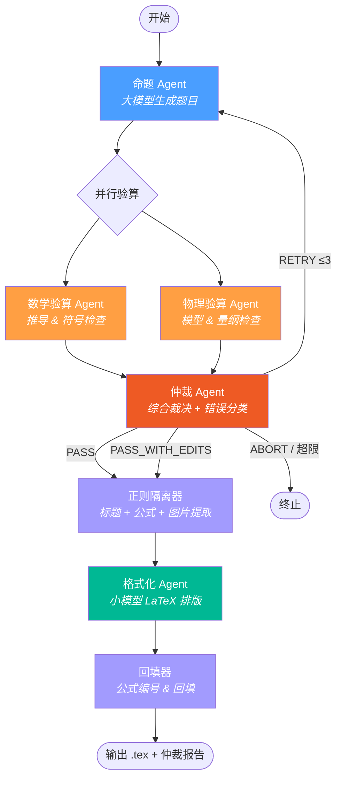
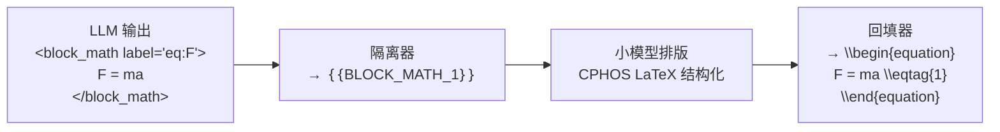

# CPhOS 物理竞赛题全自动生成系统

基于多 Agent 状态机编排的 AI 系统，自动生成 CPhO 决赛级物理竞赛大题，经数学 / 物理双重审核与仲裁闭环后输出可编译的 LaTeX 文档。

## 工作流



**节点说明**

| 节点 | 模型 | 职责 |
|------|------|------|
| 命题 Agent | 大模型 | 根据主题 + 难度生成完整竞赛题（标题、题干、参考答案、评分标准） |
| 数学验算 Agent | 大模型 | 验证代数 / 微积分推导、符号一致性 |
| 物理验算 Agent | 大模型 | 验证物理模型、量纲、边界条件 |
| 仲裁 Agent | 大模型 | 综合两份审核，输出 PASS / RETRY / ABORT 结构化裁决（含理由 + 错误分类）；重试上限后仅剩用语问题时自动 PASS_WITH_EDITS |
| 正则隔离器 | — | 提取标题、Block 公式、Inline 公式、Figure 占位符 |
| 格式化 Agent | 小模型 | 对占位符文本做 CPHOS LaTeX 排版（不接触数学公式） |
| 回填器 | — | 公式回填、CPHOS 命令生成、交叉引用、插图占位 |

## 快速开始

> 需要 Python ≥ 3.11 和 [uv](https://docs.astral.sh/uv/)。

配置项目依赖：
```bash
uv sync
```

快速运行示例：
```bash
copy .env.example .env          # Windows
# cp .env.example .env          # macOS / Linux
# 编辑 .env，选择 LLM 服务商并填入对应密钥和模型名称

# 5. 运行
uv run physics-generator --topic "刚体力学与角动量守恒"
uv run physics-generator --topic "电磁感应" --difficulty "省级竞赛"
uv run physics-generator --topic "电磁感应" --score 60
uv run physics-generator --input task.json

# 基于参考文献命题
uv run physics-generator --topic "热辐射" --reference paper.pdf
uv run physics-generator --topic "流体力学" --url "https://example.com/article"

# 改编已有题目
uv run physics-generator --adapt existing_problem.tex --difficulty "决赛"
```

运行测试：
```bash
# 6. 测试
uv run pytest -v
```

### 环境变量

| 变量 | 说明 | 示例 |
|------|------|------|
| `LLM_PROVIDER` | LLM 服务商 | `openrouter`（默认）/ `openai_compatible` |
| `OPENROUTER_API_KEY` | OpenRouter API 密钥 | `sk-or-...` |
| `LLM_API_KEY` | OpenAI 兼容 API 密钥（仅 `openai_compatible`） | `sk-...` |
| `LLM_BASE_URL` | OpenAI 兼容 API 地址（仅 `openai_compatible`） | `https://api.deepseek.com/v1` |
| `BIG_MODEL_NAME` | 大模型（命题 / 验算 / 仲裁） | `google/gemini-2.5-pro-preview` |
| `SMALL_MODEL_NAME` | 小模型（格式化排版） | `openai/gpt-4o-mini` |

### CLI 参数

```
physics-generator --topic TEXT           # 必填：物理主题（与 --input/--adapt 互斥）
                  --input FILE           # 从 JSON 文件加载（与 --topic/--adapt 互斥）
                  --adapt FILE           # 基于已有题目改编（与 --topic/--input 互斥）
                  --difficulty TEXT       # 可选，默认 "国家集训队"
                  --score INT            # 可选，题目总分（20-80，默认 40）
                  --reference FILE       # 参考文献文件（PDF/TXT/MD/TEX），可多次指定
                  --url URL              # 参考网页 URL，可多次指定
                  --log                  # 追加运行记录到 TEST_LOG.md
```

### 难度等级

系统根据 `--difficulty` 参数自动映射到三个竞赛等级，影响命题、验算和仲裁的行为：

| 等级 | 触发关键词 | 物理范围 |
|------|-----------|---------|
| 复赛（fusai） | 复赛、省赛、省级、预赛 | 经典力学、基础热力学、几何光学、基础电磁学 |
| 决赛（juesai） | 决赛（默认） | +完整电磁学、刚体、基础相对论、统计物理初步 |
| 集训队（jixundui） | 集训、国家队、CMO、IPhO | 不设上限，但高级工具必须在题干给出 |

## 项目结构

```
AI_Question/
├── pyproject.toml                # 项目元数据 & 依赖
├── .env.example                  # 环境变量模板
├── src/
│   ├── app/                      # CLI 入口与输出写入
│   │   ├── __init__.py           # main(), _cli(), _write_outputs()
│   │   └── __main__.py
│   ├── client/                   # LLM 客户端（多服务商抽象）
│   │   ├── __init__.py           # get_client() 工厂 + stream_chat() 兼容包装
│   │   ├── base.py               # BaseLLMClient 抽象基类 + UsageInfo
│   │   ├── openrouter.py         # OpenRouter 实现
│   │   └── openai_compat.py      # 通用 OpenAI 兼容实现（DeepSeek 等）
│   ├── config/                   # 全局配置
│   │   └── settings.py           # 环境变量、模型参数、正则表达式、路径
│   ├── prompts/                  # YAML 提示词管理
│   │   ├── __init__.py           # load(agent, key, **kwargs) 加载器
│   │   ├── generator.yaml        # 命题 Agent 提示词
│   │   ├── verifier.yaml         # 数学 / 物理验算 Agent 提示词
│   │   ├── arbiter.yaml          # 仲裁 Agent 提示词
│   │   └── formatter.yaml        # 格式化 Agent 提示词
│   ├── reader/                   # 参考资料读取器
│   │   ├── __init__.py           # extract_content() 工厂 + 自动类型检测
│   │   ├── base.py               # ReaderResult + truncate_content()
│   │   ├── pdf_reader.py         # PyMuPDF 提取 PDF 文本
│   │   ├── web_reader.py         # httpx + html2text 抓取网页
│   │   ├── text_reader.py        # TXT/MD/TEX 直接读取
│   │   └── problem_reader.py     # 改编模式（复用 text/pdf reader）
│   ├── generator/                # 命题与审核 Agent
│   │   ├── generator.py          # 命题 Agent（含难度分级逻辑）
│   │   ├── math_verifier.py      # 数学验算 Agent
│   │   ├── physics_verifier.py   # 物理验算 Agent
│   │   └── arbiter.py            # 仲裁 Agent
│   ├── formatter/                # 格式化流水线
│   │   ├── parser.py             # 正则隔离器（标题 + Block + Inline + Figure 提取）
│   │   ├── formatter.py          # 格式化 Agent（小模型 CPHOS LaTeX 排版）
│   │   └── merger.py             # 回填器（公式回填 + CPHOS 命令 + 插图占位）
│   ├── graph/                    # 工作流编排
│   │   └── workflow.py           # 纯 Python 状态机（含并行验算）
│   └── model/                    # 数据模型
│       ├── state.py              # AgentState (TypedDict)
│       ├── schema.py             # ArbiterDecision (Pydantic)
│       └── stats.py              # 运行时 Token 统计
└── tests/
    ├── test_graph.py             # 端到端集成测试（Mock LLM）
    ├── test_parser.py            # 正则隔离器单元测试
    ├── test_merger.py            # 回填器单元测试
    ├── topics.py                 # 测试用主题池加载器
    └── fixtures/
        └── topics.js             # 物理命题主题数据
```

## 输出文件

每次运行在 `output/` 下生成：

| 文件 | 内容 |
|------|------|
| `{task_id}_final.tex` | 可直接编译的 CPHOS LaTeX 成品 |
| `{task_id}_draft.md` | 大模型原始草稿 |
| `{task_id}_tagged.md` | 占位符文本（调试用） |
| `{task_id}_log.json` | 完整运行日志（裁决、理由、错误分类、审核意见、公式数等） |
| `{task_id}_report.md` | 仲裁报告（无论何种裁决结果均生成） |
| `{task_id}_assets/README.md` | 插图绘制需求（仅题目含图时生成） |

## 提示词管理

所有 Agent 的提示词存放在 `src/prompts/*.yaml`，使用 YAML 多行文本块（`|`）书写，避免 Python 字符串的转义问题。

```python
from prompts import load

# 加载系统提示词
system = load("generator", "system_prompt")

# 加载用户提示词（带变量替换）
user = load("generator", "user_prompt_initial", topic="电磁感应", difficulty="国家集训队")
```

变量替换使用 `str.replace("{key}", value)`，仅替换显式传入的 key，LaTeX 花括号和占位符不受影响。

## 技术栈

| 组件 | 技术 |
|------|------|
| 运行时 | Python ≥ 3.11 |
| 包管理 | uv + hatchling |
| LLM 网关 | OpenRouter / OpenAI 兼容 API（openai SDK + 抽象基类） |
| 结构化输出 | Pydantic + Function Calling |
| 提示词管理 | PyYAML |
| 测试 | pytest + unittest.mock |

## 占位符处理流程



## CPHOS 模板对齐

输出的 LaTeX 文档严格对齐 CPHOS 竞赛模板：

- 文档类：`\documentclass[answer]{cphos}`
- 题目环境：`\begin{problem}[总分]{标题}` — 标题由命题模型自动拟定
- 公式编号：`\eqtag{N}` / `\eqtagscore{N}{分值}` + `\label{eq:N}`
- Part 标记：`\pmark{A}\label{part:A}` / `\solPart{A}{分值}`
- 一级小问：`\subq{1}\label{q:1}` / `\solsubq{1}{分值}`
- 二级小问：`\subsubq{1.1}\label{q:1.1}` / `\solsubsubq{1.1}{分值}`
- 三级小问：`\subsubsubq{1.1.1}\label{q:1.1.1}` / `\solsubsubsubq{1.1.1}{分值}`
- 评分标准：`\scoring`（自动插入）
- 插图占位：输出时默认注释，完成人工绘图后取消注释即可显示

### 分数段命题规模引导

系统根据 `--score` 自动选择对应分段的命题规模引导：

| 分数段 | 小问数 | 复杂度 | 典型场景 |
|--------|--------|--------|----------|
| 20–39 分 | 2–3 | 物理图像 + 基本方程 | 复赛小题、模拟题 |
| 40–60 分 | 3–4 | 完整建模 + 中等推导 | 复赛大题、决赛标准题 |
| 61–80 分 | 4–5 | 深度推导 + 多级微扰 | 决赛压轴题 |

### 小问编号规范

| 层级 | 题干格式 | 解答格式 | LaTeX 命令 |
|------|---------|---------|------------|
| Part | `A. 描述文本` | `A.[X分]` | `\pmark{A}` / `\solPart{A}{X}` |
| 一级 | `(1) 描述文本` | `(1)[X分]` | `\subq{1}` / `\solsubq{1}{X}` |
| 二级 | `(1.1) 描述文本` | `(1.1)[X分]` | `\subsubq{1.1}` / `\solsubsubq{1.1}{X}` |
| 三级 | `(1.1.1) 描述文本` | `(1.1.1)[X分]` | `\subsubsubq{1.1.1}` / `\solsubsubsubq{1.1.1}{X}` |

### 仲裁错误分类

仲裁 Agent 对每次审核输出错误分类：

| 分类 | 含义 | 仲裁行为 |
|------|------|----------|
| `none` | 无错误 | 直接 PASS |
| `style` | 仅用语规范问题 | RETRY；若达到重试上限则自动切换为 PASS_WITH_EDITS 通过 |
| `fatal` | 数学 / 物理 / 逻辑错误 | RETRY → 超限后 ABORT |

