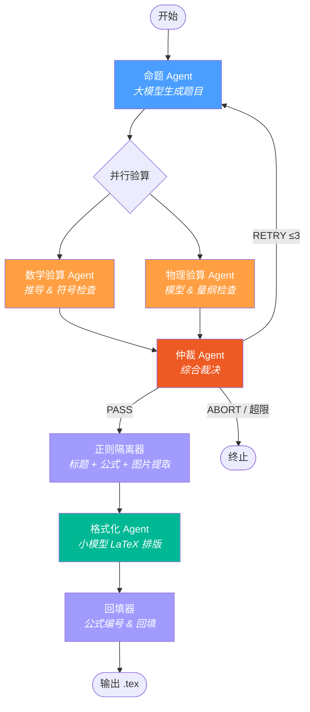
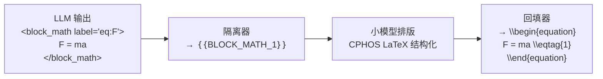

# CPhOS 物理竞赛题全自动生成系统

基于多 Agent 状态机编排的 AI 系统，自动生成 CPhO 决赛级物理竞赛大题，经数学 / 物理双重审核与仲裁闭环后输出可编译的 LaTeX 文档。

## 工作流



**节点说明**

| 节点 | 模型 | 职责 |
|------|------|------|
| 命题 Agent | 大模型 | 根据主题 + 难度生成完整竞赛题（标题、题干、参考答案、评分标准） |
| 数学验算 Agent | 大模型 | 验证代数 / 微积分推导、符号一致性 |
| 物理验算 Agent | 大模型 | 验证物理模型、量纲、边界条件 |
| 仲裁 Agent | 大模型 | 综合两份审核，输出 PASS / RETRY / ABORT 结构化裁决（含理由） |
| 正则隔离器 | — | 提取标题、Block 公式、Inline 公式、Figure 占位符 |
| 格式化 Agent | 小模型 | 对占位符文本做 CPHOS LaTeX 排版（不接触数学公式） |
| 回填器 | — | 公式回填、CPHOS 命令生成、交叉引用、插图占位 |

## 快速开始

> 需要 Python ≥ 3.11 和 [uv](https://docs.astral.sh/uv/)。

配置项目依赖：
```bash
uv sync
```

快速运行示例：
```bash
copy .env.example .env          # Windows
# cp .env.example .env          # macOS / Linux
# 编辑 .env，填入 OpenRouter API Key 和模型名称

# 5. 运行
uv run physics-generator --topic "刚体力学与角动量守恒"
uv run physics-generator --topic "电磁感应" --difficulty "省级竞赛"
uv run physics-generator --topic "电磁感应" --score 60
uv run physics-generator --input task.json
```

运行测试：
```bash
# 6. 测试
uv run pytest -v
```

### 环境变量

| 变量 | 说明 | 示例 |
|------|------|------|
| `OPENROUTER_API_KEY` | OpenRouter API 密钥 | `sk-or-...` |
| `BIG_MODEL_NAME` | 大模型（命题 / 验算 / 仲裁） | `google/gemini-2.5-pro-preview` |
| `SMALL_MODEL_NAME` | 小模型（格式化排版） | `openai/gpt-4o-mini` |

### CLI 参数

```
physics-generator --topic TEXT           # 必填：物理主题
                  --difficulty TEXT       # 可选，默认 "国家集训队"
                  --score INT            # 可选，题目总分（45-80，默认 50）
                  --input FILE           # 从 JSON 文件加载（与 --topic 互斥）
                  --log                  # 追加运行记录到 TEST_LOG.md
```

## 项目结构

```
AI_Question/
├── pyproject.toml                # 项目元数据 & 依赖
├── .env.example                  # 环境变量模板
├── src/
│   ├── app/                      # CLI 入口与输出写入
│   │   ├── __init__.py           # main(), _cli(), _write_outputs()
│   │   └── __main__.py
│   ├── client/                   # OpenRouter 客户端
│   │   └── __init__.py           # get_client(), stream_chat(), UsageInfo
│   ├── config/                   # 全局配置
│   │   └── settings.py           # 环境变量、模型参数、正则表达式、路径
│   ├── prompts/                  # YAML 提示词管理
│   │   ├── __init__.py           # load(agent, key, **kwargs) 加载器
│   │   ├── generator.yaml        # 命题 Agent 提示词
│   │   ├── verifier.yaml         # 数学 / 物理验算 Agent 提示词
│   │   ├── arbiter.yaml          # 仲裁 Agent 提示词
│   │   └── formatter.yaml        # 格式化 Agent 提示词
│   ├── generator/                # 命题与审核 Agent
│   │   ├── generator.py          # 命题 Agent
│   │   ├── math_verifier.py      # 数学验算 Agent
│   │   ├── physics_verifier.py   # 物理验算 Agent
│   │   └── arbiter.py            # 仲裁 Agent
│   ├── formatter/                # 格式化流水线
│   │   ├── parser.py             # 正则隔离器（标题 + Block + Inline + Figure 提取）
│   │   ├── formatter.py          # 格式化 Agent（小模型 CPHOS LaTeX 排版）
│   │   └── merger.py             # 回填器（公式回填 + CPHOS 命令 + 插图占位）
│   ├── graph/                    # 工作流编排
│   │   └── workflow.py           # 纯 Python 状态机（含并行验算）
│   └── model/                    # 数据模型
│       ├── state.py              # AgentState (TypedDict)
│       ├── schema.py             # ArbiterDecision (Pydantic)
│       └── stats.py              # 运行时 Token 统计
└── tests/
    ├── test_graph.py             # 端到端集成测试（Mock LLM）
    ├── test_parser.py            # 正则隔离器单元测试
    ├── test_merger.py            # 回填器单元测试
    ├── topics.py                 # 测试用主题池加载器
    └── fixtures/
        └── topics.js             # 物理命题主题数据
```

## 输出文件

每次运行在 `output/` 下生成：

| 文件 | 内容 |
|------|------|
| `{task_id}_final.tex` | 可直接编译的 CPHOS LaTeX 成品 |
| `{task_id}_draft.md` | 大模型原始草稿 |
| `{task_id}_tagged.md` | 占位符文本（调试用） |
| `{task_id}_log.json` | 完整运行日志（裁决、理由、审核意见、公式数等） |
| `{task_id}_assets/README.md` | 插图绘制需求（仅题目含图时生成） |

## 提示词管理

所有 Agent 的提示词存放在 `src/prompts/*.yaml`，使用 YAML 多行文本块（`|`）书写，避免 Python 字符串的转义问题。

```python
from prompts import load

# 加载系统提示词
system = load("generator", "system_prompt")

# 加载用户提示词（带变量替换）
user = load("generator", "user_prompt_initial", topic="电磁感应", difficulty="国家集训队")
```

变量替换使用 `str.replace("{key}", value)`，仅替换显式传入的 key，LaTeX 花括号和占位符不受影响。

## 技术栈

| 组件 | 技术 |
|------|------|
| 运行时 | Python ≥ 3.11 |
| 包管理 | uv + hatchling |
| LLM 网关 | OpenRouter（openai SDK） |
| 结构化输出 | Pydantic + Function Calling |
| 提示词管理 | PyYAML |
| 测试 | pytest + unittest.mock |

## 占位符处理流程



## 输出文件

| 文件 | 说明 |
|---|---|
| `output/{id}_final.tex` | 最终 CPHOS LaTeX 成品 |
| `output/{id}_draft.md` | 命题 Agent 原始草稿 |
| `output/{id}_tagged.md` | 公式隔离后的占位符文本 |
| `output/{id}_log.json` | 完整运行日志 |
| `output/{id}_assets/` | 插图绘制需求（仅含图时） |

## CPHOS 模板对齐

输出的 LaTeX 文档严格对齐 CPHOS 竞赛模板：

- 文档类：`\documentclass[answer]{cphos}`
- 题目环境：`\begin{problem}[总分]{标题}` — 标题由命题模型自动拟定
- 公式编号：`\eqtag{N}` / `\eqtagscore{N}{分值}` + `\label{eq:N}`
- 题干小问：`\subq{N}\label{q:N}`
- 解答小问：`\solsubq{N}{分值}`
- 评分标准：`\scoring`（自动插入）
- 插图占位：输出时默认注释，完成人工绘图后取消注释即可显示

