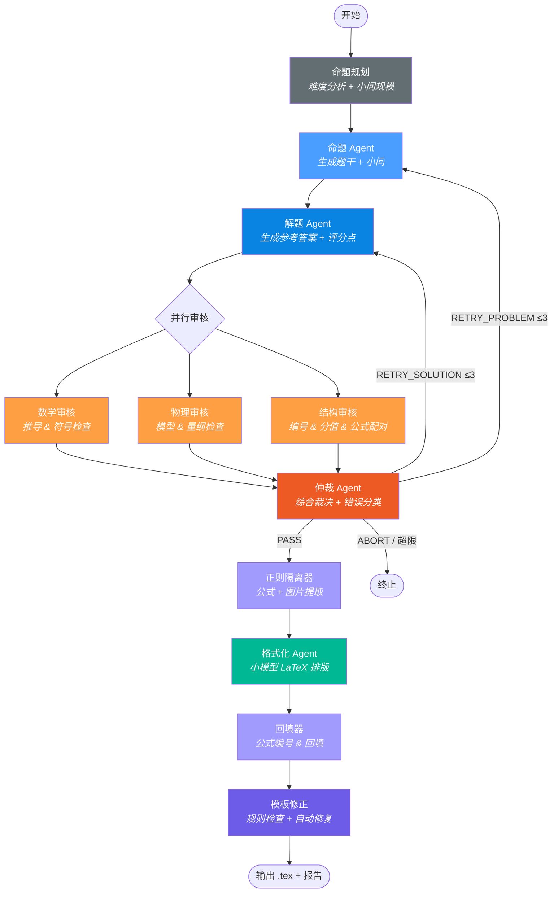
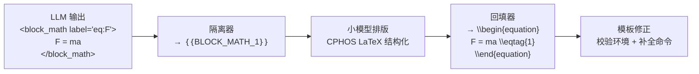

# 开发指南

CPhOS 物理竞赛题全自动生成系统的技术细节与设计文档。
面向贡献者 / 二次开发者；如果你只想跑起来，先看 [`README.md`](../README.md)。

---

## 目录

- [工作流](#工作流)
- [状态机阶段](#状态机阶段)
- [节点说明](#节点说明)
- [仲裁路由](#仲裁路由)
- [LLM 调用预算](#llm-调用预算)
- [数据模型分层](#数据模型分层)
- [客户端注册中心](#客户端注册中心)
- [提示词管理](#提示词管理)
- [占位符处理流程](#占位符处理流程)
- [CPHOS 模板对齐](#cphos-模板对齐)
- [项目结构](#项目结构)
- [配置参考](#配置参考)
- [升级指引](#升级指引)
- [技术栈](#技术栈)

---

## 工作流



---

## 状态机阶段

系统核心是一个显式状态机 `GenerationStateMachine`，阶段定义如下：

```
INIT → PLANNING → PROBLEM_GENERATING → SOLUTION_GENERATING
     → REVIEWING → ARBITRATING
     → FORMATTING → TEMPLATE_FIXING → DONE
     任意阶段异常 → ERROR
```

源码：`src/engine/state_machine.py`。每次阶段切换都打 `阶段转移: X → Y`
INFO 日志，便于追踪。

---

## 节点说明

| 节点 | 模型 | 职责 |
|------|------|------|
| 命题规划 | 大模型 | 分析主题与难度，输出规划笔记（小问数量、分值分配、物理情境建议） |
| 命题 Agent | 大模型 | 根据规划生成题干与小问，支持重试时接收仲裁反馈 |
| 解题 Agent | 大模型 | 根据题干生成参考答案与评分点，解题与命题独立迭代 |
| 数学审核 | 大模型 | 验证代数 / 微积分推导、符号一致性 |
| 物理审核 | 大模型 | 验证物理模型、量纲、边界条件 |
| 结构审核 | **纯规则** | 小问编号连续性、分值合计、block_math 配对、label 唯一性 |
| 仲裁 Agent | 大模型 | 综合三份审核报告，通过 Function Calling 输出结构化裁决 |
| 正则隔离器 | — | 提取标题、Block / Inline 公式、Figure 占位符 |
| 格式化 Agent | 小模型 | 对占位符文本做 CPHOS LaTeX 排版（不接触数学公式） |
| 回填器 | — | 公式回填、CPHOS 命令生成、交叉引用、插图占位 |
| 模板修正 | **纯规则** | 校验 LaTeX 环境匹配、占位符残留、自动补 `\scoring` 和 `\documentclass` |

---

## 仲裁路由

| 裁决 | 含义 | 路由 |
|------|------|------|
| `PASS` | 题目合格 | → 后处理流水线 |
| `RETRY_PROBLEM` | 题干有误 | → 回到命题 Agent（重新出题），`problem_retry_count += 1` |
| `RETRY_SOLUTION` | 解答有误 | → 回到解题 Agent（保留题干，重新解题），`solution_retry_count += 1` |
| `ABORT` | 不可修复错误 | → 流程终止 |
| *阶段重试超限 + `style`* | 仅有用语问题 | → 自动切为 `PASS_WITH_EDITS` |

**重试计数语义**（分阶段计数）：

- `problem_retry_count` 仅记录 `RETRY_PROBLEM` 的触发次数；`solution_retry_count` 仅记录 `RETRY_SOLUTION` 的触发次数；`retry_count` = 两者之和。
- 首轮生成不计 retry：仅当仲裁返回 `RETRY_PROBLEM` / `RETRY_SOLUTION` 时对应阶段 +1，PASS / ABORT 不递增。
- 熔断条件：任一阶段达到 `MAX_RETRY_COUNT`（默认 3）即终止当前阶段；总次数达 `2 × MAX_RETRY_COUNT` 硬兜底，避免两阶段交替震荡。

### 仲裁错误分类

仲裁 Agent 对每次审核输出错误分类（schema 强制使用 `Literal` 字面量约束）：

| 分类 | 含义 | 仲裁行为 |
|------|------|----------|
| `none` | 无错误 | 直接 PASS |
| `style` | 仅用语规范问题 | RETRY；若达到重试上限则自动切换为 PASS_WITH_EDITS 通过 |
| `fatal` | 数学 / 物理 / 逻辑错误 | RETRY → 超限后 ABORT |

`decision` 与 `error_category` 的合法组合在 `src/prompts/arbiter.yaml`
中以"强制约束"段显式列出，并在 `src/model/schema.py`
通过 Pydantic Literal 类型在解析时拒绝任何非法值。

---

## LLM 调用预算

一次成功（首轮 PASS）的 LLM 调用数：

| 阶段 | 次数 | 使用模型 |
|------|------|----------|
| 命题规划（planner） | 1 | `BIG_MODEL_NAME` |
| 命题生成 | 1 | `BIG_MODEL_NAME` |
| 解题生成 | 1 | `BIG_MODEL_NAME` |
| 数学审核 + 物理审核（并行） | 2 | `BIG_MODEL_NAME` |
| 结构审核 | **0（纯规则，无 LLM 调用）** | — |
| 仲裁 | 1 | `BIG_MODEL_NAME` |
| 格式化 | 1 | `SMALL_MODEL_NAME` |
| 模板修正 | **0（纯规则，无 LLM 调用）** | — |

合计：**首轮 PASS 的基准调用 = 6 次 BIG + 1 次 SMALL**。每次仲裁返回 RETRY 时追加调用如下：

- `RETRY_PROBLEM`：**+5 次 BIG**（重出题 + 重解题 + 数学审核 + 物理审核 + 仲裁；RETRY_PROBLEM 会同时触发解题阶段重跑）
- `RETRY_SOLUTION`：**+4 次 BIG**（仅重解题 + 数学审核 + 物理审核 + 仲裁；保留题干）

> **为什么 planner 使用 BIG_MODEL？** 命题规划需要综合难度目标、分值分配与物理模型选型，是后续所有生成的上下文锚点，使用强模型可显著降低下游重试率；相对 6 次 BIG 的基础开销，再加 1 次是边际可忽略的成本。

---

## 数据模型分层

工作流字典按阶段拆成多个独立的 `TypedDict`，每个 Agent 只负责自己阶段的字段，避免单一巨型容器在全局流转。

| 阶段记录 | 写入方 | 关键字段 |
|----------|--------|----------|
| `TaskInput` | `spec.normalizer`, `spec.planner` | `mode`, `topic`, `source_material`, `difficulty`, `total_score`, `difficulty_profile`, `planning_notes` |
| `GenerationOutput` | `agents.problem_generator`, `agents.solution_generator` | `title`, `problem_text`, `solution_text`, `draft_content` |
| `ReviewOutput` | `agents.reviewers` 内三个互斥子 Agent | `math_review`, `physics_review`, `structure_review` |
| `ArbitrationOutput` | `agents.arbiter` | `arbiter_decision`, `arbiter_feedback`, `arbiter_reason`, `error_category`, `retry_count`, `problem_retry_count`, `solution_retry_count` |
| `LaTeXOutput` | `latex.{isolate,format,merge,template_agent}` | `formula_dict`, `inline_dict`, `figure_dict`, `tagged_text`, `formatted_text`, `final_latex`, `template_report`, `figure_descriptions` |

顶层 `WorkflowData` 是上述 5 个 TypedDict 的合并视图（`TypedDict` 多继承 + `total=False`）。
状态机以 `data.update(stage_output)` 把每个阶段的产物合并进同一个 dict 实例。

源码：`src/model/state.py`。新增字段时**先决定它属于哪个阶段，再加到对应的阶段
TypedDict**——不要直接往 `WorkflowData` 加字段。

---

## 客户端注册中心

`src/client/base.py` 定义了：

- `BaseLLMClient` ABC：`stream_chat(**kwargs)` / `create(**kwargs)` /
  `from_config()` 三个抽象方法
- `@register_provider("name")` 类装饰器：把 `BaseLLMClient` 子类注册到指定名称下
- `get_provider_class(name)` / `supported_providers()`：查表与列名

`src/client/__init__.py` 中的 `get_client()` 仅做"读 `LLM_PROVIDER` →
查表 → 调子类的 `from_config()`"三步，**不再有 `if/elif` 分支**。

新增服务商示例：

```python
# src/client/my_provider.py
from client.base import BaseLLMClient, register_provider

@register_provider("my_provider")
class MyProviderClient(BaseLLMClient):
    @classmethod
    def from_config(cls):
        from config.config import MY_KEY
        if not MY_KEY:
            raise ValueError("环境变量缺失: MY_KEY ...")
        return cls(api_key=MY_KEY)

    def stream_chat(self, **kw): ...
    def create(self, **kw): ...
```

只需在 `src/client/__init__.py` 顶部加一行 `import client.my_provider`
（触发装饰器副作用注册），之后 `LLM_PROVIDER=my_provider` 即可生效。

---

## 提示词管理

所有 Agent 的提示词存放在 `src/prompts/*.yaml`，使用 YAML 多行文本块（`|`）书写，避免 Python 字符串的转义问题。

```python
from prompts import load

# 加载系统提示词
system = load("problem_generator", "system_prompt")

# 加载用户提示词（带变量替换）
user = load("problem_generator", "user_prompt_topic",
            topic="电磁感应", difficulty="国家集训队")
```

变量替换使用 `str.replace("{key}", value)`，仅替换显式传入的 key，LaTeX 花括号和占位符不受影响。

---

## 占位符处理流程



设计原则：
1. **格式化 Agent 永远看不到原始公式** — 隔离器先把所有 `<block_math>` /
   `<inline_math>` / `<figure>` 替换成占位符，避免小模型篡改公式或在公式内部插标点。
2. **占位符完整性校验** — `latex/format.py` 在拿到小模型输出后会比对占位符
   集合是否一致；任何缺失或新增都会触发兜底重组。
3. **回填用 CPHOS 命令** — `latex/merge.py` 按文档顺序为每个 block 公式
   分配编号 `\eqtag{N}` / `\eqtagscore{N}{score}`，并生成 `\label{eq:N}`
   交叉引用。

---

## CPHOS 模板对齐

输出的 LaTeX 文档严格对齐 CPHOS 竞赛模板：

- 文档类：`\documentclass[answer]{cphos}`
- 题目环境：`\begin{problem}[总分]{标题}` — 标题由命题模型自动拟定
- 公式编号：`\eqtag{N}` / `\eqtagscore{N}{分值}` + `\label{eq:N}`
- Part 标记：`\pmark{A}\label{part:A}` / `\solPart{A}{分值}`
- 一级小问：`\subq{1}\label{q:1}` / `\solsubq{1}{分值}`
- 二级小问：`\subsubq{1.1}\label{q:1.1}` / `\solsubsubq{1.1}{分值}`
- 三级小问：`\subsubsubq{1.1.1}\label{q:1.1.1}` / `\solsubsubsubq{1.1.1}{分值}`
- 评分标准：`\scoring`（自动插入）
- 插图占位：输出时默认注释，完成人工绘图后取消注释即可显示

### 分数段命题规模引导

系统根据 `--score` 自动选择对应分段的命题规模引导：

| 分数段 | 小问数 | 复杂度 | 典型场景 |
|--------|--------|--------|----------|
| 20–39 分 | 2–3 | 物理图像 + 基本方程 | 复赛小题、模拟题 |
| 40–60 分 | 3–4 | 完整建模 + 中等推导 | 复赛大题、决赛标准题 |
| 61–80 分 | 4–5 | 深度推导 + 多级微扰 | 决赛压轴题 |

### 小问编号规范

| 层级 | 题干格式 | 解答格式 | LaTeX 命令 |
|------|---------|---------|------------|
| Part | `A. 描述文本` | `A.[X分]` | `\pmark{A}` / `\solPart{A}{X}` |
| 一级 | `(1) 描述文本` | `(1)[X分]` | `\subq{1}` / `\solsubq{1}{X}` |
| 二级 | `(1.1) 描述文本` | `(1.1)[X分]` | `\subsubq{1.1}` / `\solsubsubq{1.1}{X}` |
| 三级 | `(1.1.1) 描述文本` | `(1.1.1)[X分]` | `\subsubsubq{1.1.1}` / `\solsubsubsubq{1.1.1}{X}` |

---

## 项目结构

```
AI_Question/
├── pyproject.toml                  # 项目元数据 & 依赖
├── .env.example                    # 环境变量模板
├── README.md                       # 用户向：特性 + 快速开始
├── docs/
│   └── DEVELOP.md                  # 开发向：技术细节（本文件）
├── src/
│   ├── app/                        # CLI 入口与输出写入
│   │   ├── __init__.py             #   main(), _cli(), _write_outputs()
│   │   └── __main__.py             #   python -m app 入口
│   │
│   ├── engine/                     # 核心状态机
│   │   └── state_machine.py        #   Phase(Enum) + GenerationStateMachine
│   │
│   ├── spec/                       # 输入规格 & 命题规划
│   │   ├── task.py                 #   QuestionMode, DifficultyProfile, TaskSpec
│   │   ├── normalizer.py           #   from_cli() / from_json() → WorkflowData
│   │   └── planner.py              #   run_planning() — LLM 命题规划
│   │
│   ├── agents/                     # 各 Agent 实现（每个文件一个 Agent）
│   │   ├── problem_generator.py    #   命题 Agent（生成题干 + 小问）
│   │   ├── solution_generator.py   #   解题 Agent（生成答案 + 评分点）
│   │   ├── reviewers.py            #   数学 / 物理 / 结构审核（并行执行）
│   │   └── arbiter.py              #   仲裁 Agent（Function Calling 结构化裁决）
│   │
│   ├── latex/                      # LaTeX 后处理流水线
│   │   ├── isolate.py              #   正则隔离器（Block + Inline + Figure 提取）
│   │   ├── format.py               #   格式化 Agent（小模型 CPHOS 排版）
│   │   ├── merge.py                #   回填器（公式编号 + CPHOS 命令 + 插图）
│   │   └── template_agent.py       #   模板修正（规则检查 + 自动修复）
│   │
│   ├── client/                     # LLM 客户端（注册中心 + ABC + 多服务商）
│   │   ├── __init__.py             #   get_client() / stream_chat() 工厂
│   │   ├── base.py                 #   BaseLLMClient ABC + register_provider 装饰器 + UsageInfo
│   │   ├── openrouter.py           #   OpenRouter 实现（注册名 'openrouter'）
│   │   └── openai_compat.py        #   通用 OpenAI 兼容实现（注册名 'openai_compatible'）
│   │
│   ├── config/                     # 全局配置
│   │   └── config.py               #   基于 .env 的配置管理
│   │
│   ├── model/                      # 数据模型
│   │   ├── state.py                #   WorkflowData + 5 个阶段 TypedDict
│   │   ├── schema.py               #   ArbiterDecision (Literal 约束) + TemplateFixReport
│   │   └── stats.py                #   运行时 Token 统计
│   │
│   ├── prompts/                    # YAML 提示词
│   │   ├── __init__.py             #   load(agent, key, **kwargs) 加载器
│   │   ├── planning.yaml           #   命题规划提示词（4 种模式）
│   │   ├── problem_generator.yaml  #   命题 Agent 提示词
│   │   ├── solution_generator.yaml #   解题 Agent 提示词
│   │   ├── reviewers.yaml          #   数学 / 物理审核提示词
│   │   ├── arbiter.yaml            #   仲裁 Agent 提示词（含强制枚举约束）
│   │   └── formatter.yaml          #   格式化 Agent 提示词
│   │
│   └── utils/                      # 工具函数
│       └── files.py                #   write_text(), write_json()
│
└── tests/
    ├── test_state_machine.py       # 状态机集成测试（Mock LLM）
    ├── test_parser.py              # 正则隔离器单元测试
    ├── test_merger.py              # 回填器单元测试
    ├── topics.py                   # 测试用主题池加载器
    └── fixtures/
        └── topics.js               # 物理命题主题数据
```

---

## 配置参考

完整环境变量列表（带默认值）：

| 变量 | 说明 | 默认值 |
|------|------|--------|
| `LLM_PROVIDER` | LLM 服务商（`openrouter` / `openai_compatible`） | `openrouter` |
| `OPENROUTER_API_KEY` | OpenRouter API 密钥 | — |
| `LLM_API_KEY` | OpenAI 兼容 API 密钥（仅 `openai_compatible`） | — |
| `LLM_BASE_URL` | OpenAI 兼容 API 地址（仅 `openai_compatible`） | — |
| `BIG_MODEL_NAME` | 大模型（命题 / 审核 / 仲裁） | — |
| `SMALL_MODEL_NAME` | 小模型（格式化排版） | — |
| `BIG_MODEL_TEMPERATURE` | 大模型温度 | `0.7` |
| `BIG_MODEL_MAX_TOKENS` | 大模型最大 token 数 | `32768` |
| `ARBITER_MAX_TOKENS` | 仲裁最大 token 数 | `4096` |
| `SMALL_MODEL_TEMPERATURE` | 小模型温度 | `0.0` |
| `SMALL_MODEL_MAX_TOKENS` | 小模型最大 token 数 | `8192` |
| `MODEL_TIMEOUT` | HTTP 超时（秒） | `600` |
| `MAX_RETRY_COUNT` | 单阶段最大重试轮数 | `3` |
| `OUTPUT_DIR` | 输出目录 | `output` |

---

## 升级指引

本仓库历史上做过一次大重构（包结构 + 模块路径变化）。已有的 `.env`
通常**无需改动即可继续运行**。如果你是从 `feat/architecture-restructure`
之前的版本（或 `main` 上的 `d355fe7` 及更早）升级，参考下表：

| 类别 | 旧 | 新 | 迁移动作 |
|------|-----|----|---------|
| 配置模块 | `src/config/settings.py` | `src/config/config.py` | 仅在你直接 `import` 过该模块时需改：`from config.settings import X` → `from config.config import X` |
| 包布局 | `src/generator/`、`src/graph/`、`src/formatter/` | `src/agents/`、`src/engine/`、`src/latex/` | 老包已删除；如有自定义脚本 `import` 了它们，改为对应新位置 |
| 环境变量 | `BIG_MODEL_TEMPERATURE` 等为代码内常量 | 全部改为 `.env` 可配置，默认值不变 | 不需要动；如想调整，参照 [`.env.example`](../.env.example) 往自己的 `.env` 里补 |
| 新增环境变量 | — | `OUTPUT_DIR`（可选，有默认值） | 不需要动；按需追加 |
| 已移除环境变量 / CLI / 模块 | `ENABLE_EXTERNAL_REVIEW` / `--review` / `src/integration/` | 整体移除 | 系统不再集成外部审题 CLI（`ai-reviewer`），所有审核在状态机内由本仓库 Agent 完成；旧 `.env` 中的相关值可直接删除（保留也不报错，仅被忽略） |
| 客户端 | 工厂函数硬编码 if/elif | 注册中心 `@register_provider("name")` | 新增服务商无需改 `client/__init__.py`；老调用 `get_client()` 不变 |
| 数据模型 | 单一 `WorkflowData` 大字典 | 拆分为 5 个阶段 TypedDict（`TaskInput` / `GenerationOutput` / `ReviewOutput` / `ArbitrationOutput` / `LaTeXOutput`） | 现有按 `data["k"]` 访问继续可用；新增字段时按归属阶段添加 |
| 必填环境变量 | `BIG_MODEL_NAME`、`SMALL_MODEL_NAME` + 一个服务商密钥 | 同左 | 无变化 |

**推荐操作**：`diff` 一下自己的 `.env` 与仓库里的 `.env.example`，把新增项按需补齐；其它的什么都不用改。拉完代码直接 `uv sync && uv run physics-generator --topic ...` 即可。

---

## 技术栈

| 组件 | 技术 |
|------|------|
| 运行时 | Python ≥ 3.11 |
| 包管理 | uv + hatchling |
| LLM 网关 | OpenRouter / OpenAI 兼容 API（openai SDK + 注册中心 ABC） |
| 结构化输出 | Pydantic（`Literal` 字面量约束）+ Function Calling |
| 工作流编排 | 纯 Python 状态机（无第三方框架依赖） |
| 提示词管理 | PyYAML |
| 测试 | pytest + unittest.mock |
